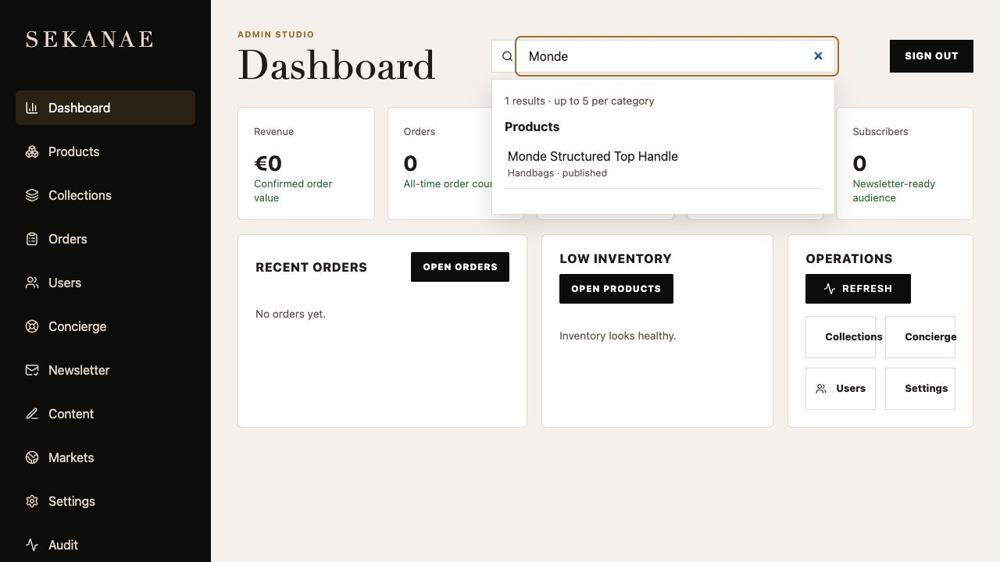
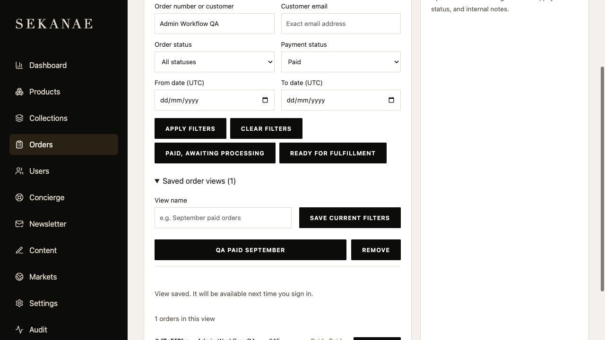

# Admin improvements

Implemented locally on 5 September 2026. Production has not been deployed or modified.

## Dashboard and global search

The low-stock metric and low-inventory list now both include only active, published products with inventory at or below the shared threshold of five, including zero. Products without an inventory record count as zero. Healthy stock no longer appears in the low-inventory list. The product-page low-stock alert follows the same published-product rule.

The header search starts after two characters, debounces requests, groups up to five results each for products, orders and users, and links to the matching detail. Orders can be found by their ID prefix, customer name or email. Search requests are cancelled as the query changes; loading, empty and failure states are explicit. The search input has an accessible label; results are normal keyboard-accessible links and Escape dismisses the panel.

## Order filters and saved views

Orders support order-number/customer search, exact customer email, order status, payment status and an inclusive UTC date range. Invalid or reversed dates are rejected. Results are paginated in batches of 25. Apply filters starts at page one; Clear filters resets all fields. Presets cover paid orders awaiting processing and paid orders in processing awaiting fulfillment.

Expand **Saved order views**, name the current filters and save them. Views are stored in the database for the signed-in admin and can be reopened or removed. Inputs/selects use a consistent 44px minimum height, with visible focus treatment. Order rows show both order and payment status.

## Resumable CSV reviews

Use **Save review for later** to store CSV edits before import. Under **Saved CSV reviews**, Resume restores rows, invalid values that still need correction, and prior row results. Saving reviews never creates products. The five required CSV fields remain unchanged.

The final import saves the complete review before starting uploads, then persists each row result with a small PATCH request. A save failure pauses further imports and explains how to retain the latest state. Successful rows remain locked on resume. Optimistic revisions reject stale updates from another tab. Save a new copy preserves the current local edits when resolving a conflict.

Raw image files are intentionally not saved with the review; the CSV file-name references remain, and admins must reselect files on resume. Actual image uploads still occur only at final confirmation. Unsaved edits are not automatically preserved between sessions: use Save review for later.

## Deployment and verification

- New migration: `database/migrations/017_admin_saved_work.sql`. It is registered in the standard migration runner and has been applied only to the separate local `sekanae_admin_dev` database.
- New authenticated `/api/admin/saved-work` endpoints enforce actor ownership and optimistic revisions, including incremental CSV row-result updates.
- Build, frontend/API typechecks and ESLint passed. The production build still reports a large-bundle warning.
- 28 current unit/regression tests passed; four opt-in database suites skip unless their test database variables are set. The dedicated workflow database run passed all four tests, including UTC boundaries, pagination, consistent stock predicates, authentication, ownership, server-instance persistence, row-result saving and stale-update conflicts.
- Browser checks verified product/order global-search navigation, grouped order/user results, payment-filtered orders, saving/restoring an order view, resuming a CSV review in a fresh sign-in and saving an edited price. The file-picker test stalled and the old frontend process stopped during verification; the frontend was restarted and saved-review UI checks continued using a local API-created fixture. Native date entry was not completed through the browser automation; date-range behavior was tested against the database.
- Temporary local QA orders and saved-work fixtures from this run were removed. No email was sent, no payment was initiated and no production service was changed.
