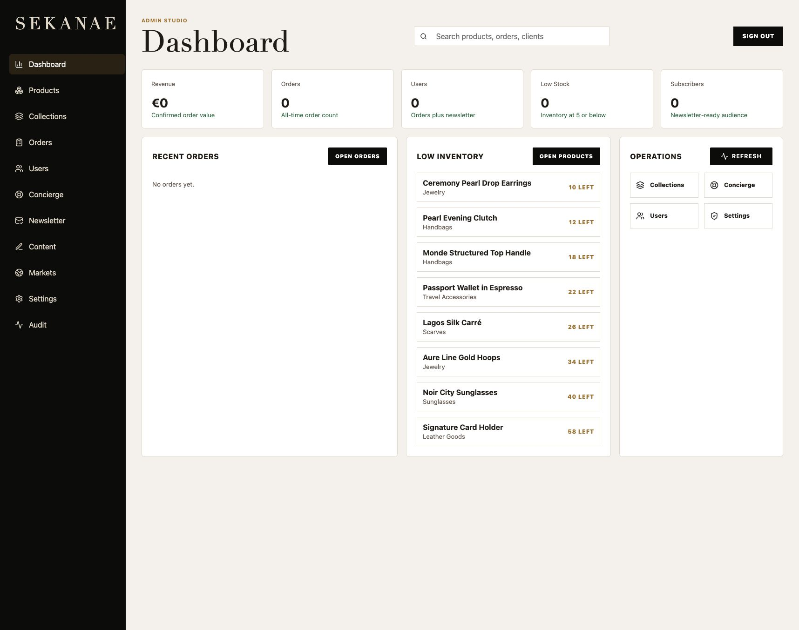
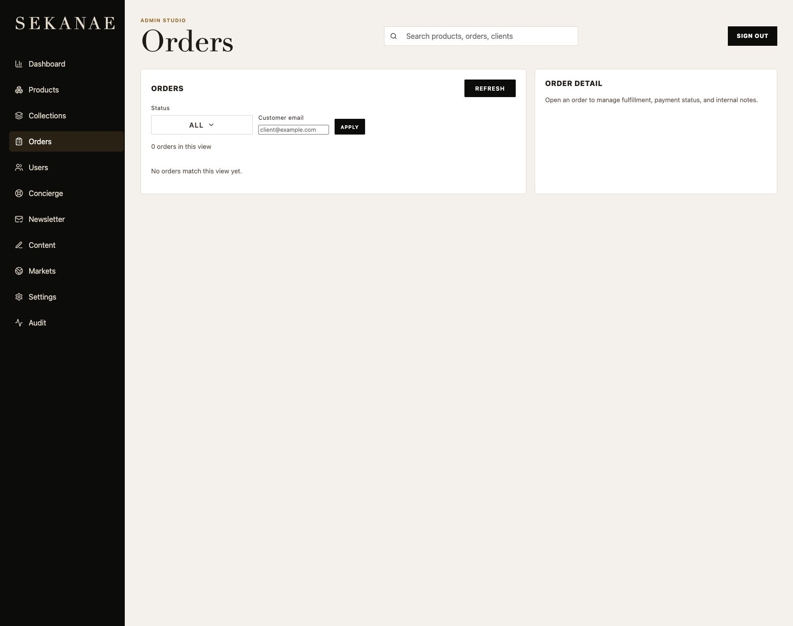
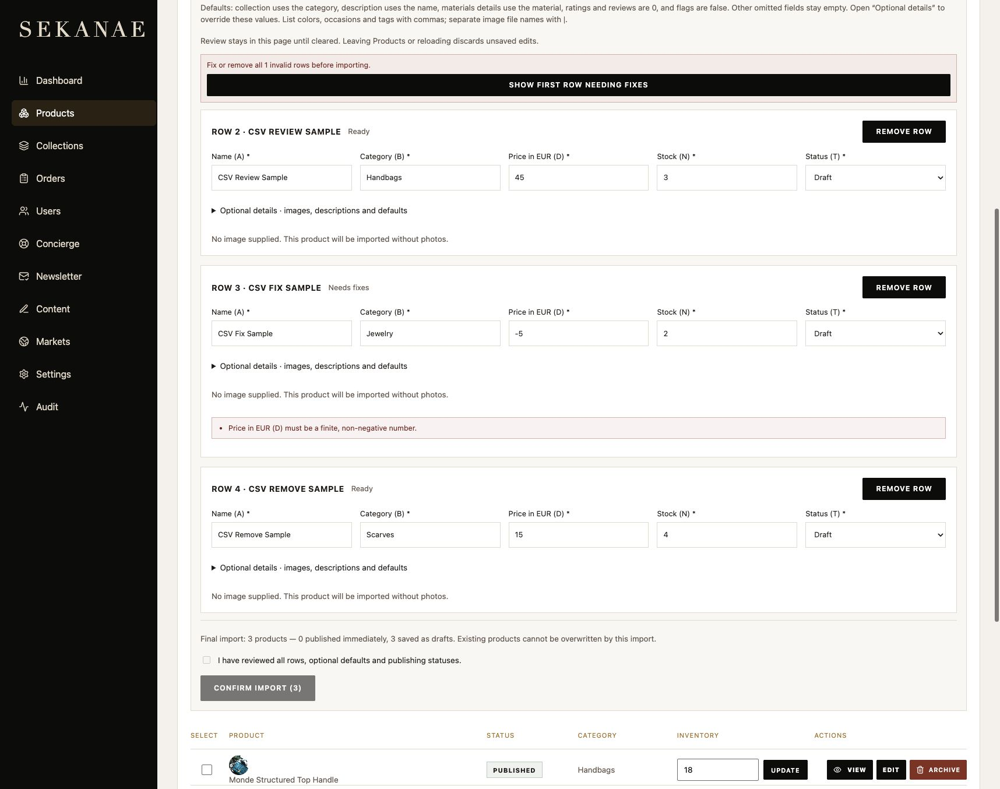
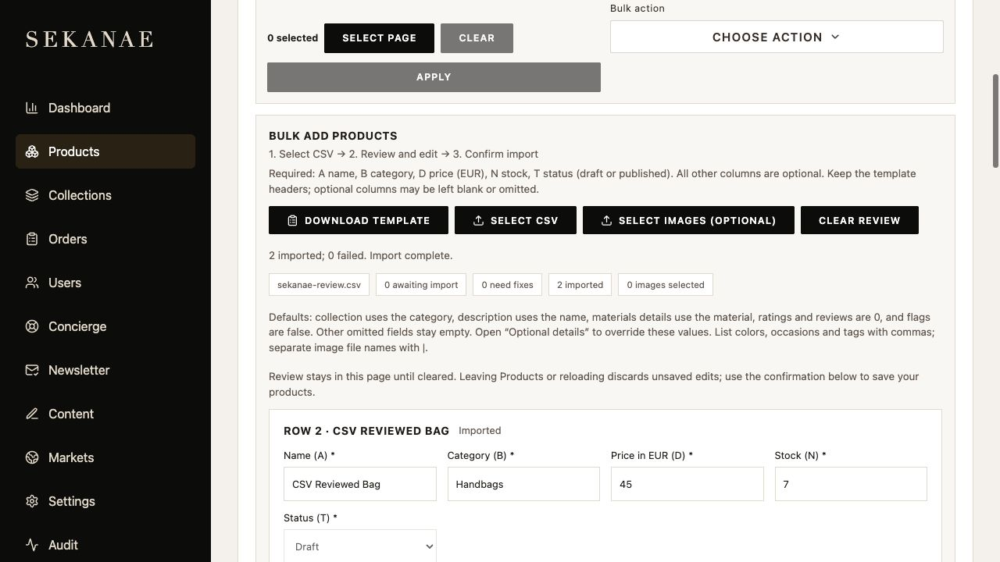

# Admin review and CSV import update

This is the original audit snapshot. The dashboard, search, order-filter and review-persistence follow-ups are now implemented locally; see [Admin improvements](../admin-improvements/implementation.md).

Reviewed locally on 5 September 2026 with a separately seeded development database. This is a scoped review of Dashboard, Orders and the product CSV workflow, not a production-wide audit.

## 1. Dashboard — clear layout; misleading stock information

The navigation and metric cards make the major admin areas easy to find. However, the **Low stock** metric is 0 while **Low inventory** lists products with 10–58 units. Both should use the same threshold, with an explicit healthy empty state. Alternatively, rename the list to “Lowest inventory” if it intentionally includes healthy stock.

The header promises search across products, orders and clients, but the input in `AdminPage.tsx` has no value, change handler or submit behavior. Make this a real search with grouped results and keyboard navigation. Give the control an explicit accessible label rather than relying only on its placeholder.

Add date ranges and comparison periods to revenue and order metrics, plus quick links to orders awaiting fulfillment and out-of-stock products.

## 2. Orders — usable starting point; limited investigation tools

Status and customer-email filters are present, with a clear empty state and a separate detail area. The email input is visibly much shorter than its neighboring status control; standardize field height and focus styling.

Add order-number search, date range, payment status, fulfillment status, and a clear-filter action. Saved views such as “Paid, awaiting fulfillment” would reduce repeated filtering.

There were no orders in the local development database, so populated order details, payment transitions and fulfillment actions were not visually audited.

## 3. CSV review — implemented and verified

The flow is now **select CSV → review/edit → confirm import**. Only these template columns are mandatory:

| Column | Header | Validation |
| --- | --- | --- |
| A | name | Nonempty; generates the product ID and URL |
| B | category | Nonempty |
| D | price | EUR amount, nonnegative, up to two decimal places |
| N | stock | Nonnegative whole number |
| T | status | draft or published |

Headers identify fields even when reordered. Optional columns can be omitted or blank. The template retains its original 20-column order and fills only the five required fields in its sample row.

Every required and optional field is editable. Admins can remove rows and correct errors in place. All remaining rows must pass validation before import; the importer never silently skips invalid rows. A final checkbox and button make the save explicit. Editing values or image selections resets confirmation. The final summary states how many products will publish immediately versus remain drafts.

Missing collection defaults to category; missing description defaults to name; materials details use the provided material; ratings/reviews default to zero and flags to false. Other facts remain empty. No materials, dimensions, shipping claims or photos are invented. Missing images produce a visible warning. If file names are supplied, they must match selected local image files; uploads start only at final confirmation.

Review is paginated in groups of 10, with a 1,000-row / 5 MB CSV limit. CSV handling covers BOM, quoted commas, escaped quotes, multiline cells, CRLF and reordered headers. Malformed row widths/quoting and duplicate headers are rejected.

The next improvement is saving review drafts and import jobs on the server, with resume, cancel and exportable failure reports. Current unsaved review state is held in memory. Reload/close and normal link navigation warn about losing pending work; browser history navigation and sign-out do not yet offer a resumable draft.

## 4. Confirmation — verified persistence and duplicate protection

Browser verification used three local sample rows. It changed a name, stock and optional description, corrected a negative price, removed one row, and confirmed the remaining two as drafts. A database query before confirmation returned zero matching products; afterward it returned exactly the two edited products, with the removed row absent. These two clearly named test drafts remain in the local development database for inspection.

Successful rows are locked and excluded from retries. Failed rows retain individual errors and can be edited/retried. Each successful import gets an audit entry. The new authenticated `/api/admin/products/import` endpoint enforces create-only behavior in the database, so existing or archived products cannot be overwritten by a duplicate CSV. Imports commit per product, so a network failure can leave a partially completed batch; the UI reports that state.

## Validation and limits

- TypeScript frontend/API checks, ESLint and production build passed. Vite reports an existing large-bundle warning; splitting admin code from storefront code is a useful performance follow-up.
- 18 unit/regression tests passed; the optional database suites are skipped without their explicit database environment variables.
- The CSV database integration test passed separately, covering authentication, required fields, minimal imports, duplicate IDs/URLs, unchanged existing inventory and audit entries. It cleans up its own test record.
- Real Cloudinary uploads were not exercised because local Cloudinary credentials are not configured. Filename matching and optional-image behavior were tested.
- Labels, native controls, visible error text and focus styles are present in the review editor. A full keyboard/screen-reader/contrast audit and phone-width testing remain outside this scoped review.
- The existing single-product form still asks for its full merchandising fields and photos when saving; a follow-up should align that editor with minimal CSV products and show a content-completeness checklist.

## Local access

`npm run api:dev` reads `.env.local` in development, preserving explicitly exported variables. Test and production environments do not load that file. The ignored file contains the generated local API key, development login and a connection to `sekanae_admin_dev`. Credentials are not included in this report. Production configuration was not changed.
